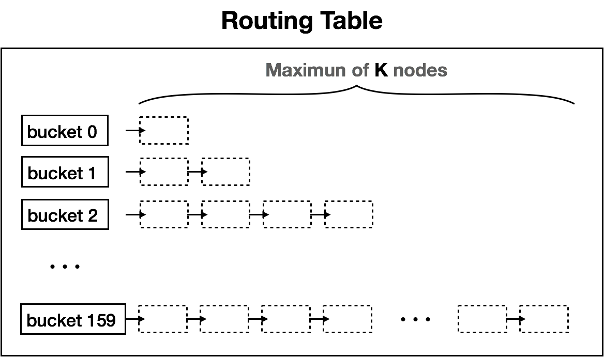

# P2P 网络：Kademlia 协议

[TOC]

### C/S与P2P

##### 	传统C/S网络拓扑架构

传统C/S架构被描绘成星型拓扑，这当然仅仅是特例，虽然存在各种各样拓扑形状的C/S架构，而其核心特征是不变的：**C/S 网络中的个体地位和功能是不平等的**，client个体主要消耗资源，发起请求，server个体主要提供资源并处理请求，这使得**C/S架构天然是中心化的**。

##### P2P架构

​	**对等式网络**（peer-to-peer， 简称P2P），又称**点对点技术**，是无中心服务器、依靠用户群（peers）交换信息的互联网体系，它的作用在于，减低以往网路传输中的节点，以降低资料遗失的风险。与有中心服务器的中央网络系统不同，对等网络的每个用户端既是一个节点，也有服务器的功能，任何一个节点无法直接找到其他节点，必须依靠其户群进行信息交流。

​	相比之下，p2p架构中最重要的特点在于：其网络中的个体在地位和功能上是平等的，虽然每个个体可能处理不同的请求，实际提供的资源在具体量化后可能有差异，但它们都能同时既消耗资源又提供资源。如果把整个所处网络中的资源--此处的资源包括但不限于运算能力、存储空间、网络带宽等，视为一个总量，那么p2p网络中的资源分布，是分散于各个个体中的(也许不一定均匀分布)。所以，p2p网络架构天然是去中心化的、分布式的。

​	注意上图p2p网络中，**并非每个个体与网络中其他同类均有通信**。这其实也是p2p网络的一个很重要的特点：一个个体只需要与相邻的一部分同类有通信即可，每个个体可与多少相邻个体、哪些个体有通信，是可以加以设计的。

​	根据p2p网络中节点相互之间如何联系，可以将p2p网络简单区分为无结构化的(unstructured)，和结构化的(structured)两大类。

### Kademlia 协议

​	在Kademlia协议中，每个节点都会被分配唯一的节点ID，一般是160bit的二进制数。节点之间可以计算距离，此距离不是传统意义上的长度距离，而是一个仅由两节点ID决定的距离。

##### 	节点距离与LCP

​	节点距离以节点ID的异或(XOR)值度量:

> $Dis(M,N)=XOR(M.id,N.id) $

因此，节点之间的距离越近，意味着节点ID的公共前缀越长。节点之间的距离以节点的最长公共前缀(LCP)为度量，LCP越大，表示两个节点越接近。为了简化，我们以ID长度为3位进行说明例如：

> $A.id=(110)$ 
>
> $B.id=(100)$
>
> $Dis(A,B)=XOR(A.id,B.id)=XOR(110,100)=010B=2$
>
> $LCP(A,B)=1$

​	因为每一个节点可以只与邻近几个节点通信，所以它只需要存储那一部分节点的ID就能与整个网络中的节点进行通信。

​	与节点距离相关的另外一个概念：最高位index。最高位index是距离的二进制从左往右开始数第一个1的位置(index最右侧为0,向左递增)，如010的最高位index为1。

​	在P2P网络中，宏观存在一棵二叉前缀树，此**二叉树不实际存在，不被任何节点拥有**。如下图

​	二叉树中每一个叶子都是网络中的一个节点。

​	如上图所示，对于节点110，可以分出3个子树（阴影部分所示）。左侧子树的节点与110的LCP均为0，中间子树的节点与110的LCP均为1，右侧子树的节点与110的LCP均为2。

##### K桶(K-Bucket)

​	每个节点都拥有与自身ID位数相同个数的K桶，比如上图110节点有3个K桶。子树所有节点与节点110的距离的最高位index成为了K桶的编号。编号为n的桶理论上最多可以存储2^n^个节点信息，但是实际上一个桶存储的节点个数受常数K的限制，K一般为20，必须是偶数。每个K桶中存储与自己通信的节点信息(IP address,UDP port,Node ID)。下图就是路由表的模型，由K桶组成。

##### Kademlia 协议操作类型

​	Kademlia 协议包括4种远程RPC操作：Ping，Store，Find_node，Find_value。

1.Ping检查一个节点是否在线。

2.Store通知一个节点存储一个<key,value>对，以便以后查询需要。

3.Find_node使用一个160bit的Node ID为参数（设为节点C）。当节点A向节点B使用Find_node操作查询节点C时，节点B会取出自己所知的更接近节点C的K个节点的(IP address,UDP port,Node ID)信息。

这些节点的信息可以是从一个或多个（如果最接近目标ID的K桶节点个数小于K）K桶获得。不论是哪种情况，节点B都会返回K个节点的信息给发起者。但如果节点B存储的所有K桶的节点信息加起来也没有K个，那么它会返回它存储的全部节点信息给节点A。

4.Find_value和Find_node操作类似，不同的是它只需要返回一个节点的(IP address,UDP port,Node ID)信息。

##### 路由算法

​	前面我们提到，每一个节点可以只与邻近几个节点通信，并且这些节点信息存在K桶中。那么，如果一个节点要与未与自己直接建立连接的节点进行通信，这个节点如何找到所需节点的信息(如IP地址)呢。我们会通过下面这个例子来说明。先说明一个为系统优化而设立的一个参数α，就像K一样。这里我们令α=3。(在以太坊系统中，α也是3)

​	假设现在的当前节点是 001，它想要查的目标节点是 101 节点。001的保存的Routing Table 信息如下

​	我们先计算 001 与 101 节点的距离，001 ^ 101 等于 100，$[log_{2}{100b}]=2$，[]为取整。距离为2，所以我们要去最高位index为2的bucket中取节点。因此，我们去 bucket 2 中取出α(=3)个节点的信息。如果这个K桶中的信息少于α(=3)个，则从附近多个桶中选择距离最接近100b的总共α(=3)个节点。然后对这α(=3)个节点同时进行Find_node操作。

​	下面我们只一一个节点举例。

​	节点110 的 Routing Table 信息如下：

​	节点 110 收到Find_node请求后，如果发现自己就是所要查询的节点101，那么就返回自己就是距离101最近的节点。否则，先测量自己和101的距离，110^101=011，$[log_{2}{011b}]=1$（同时我们也观察到011最高位index为1）。因此，去 bucket 1 中查找，bucket 1 中只有存储有一个节点，所以需要从旁边节点再取K-1个节点。然后将这K个节点信息返回给节点001。

​	当三个节点都返回给001各K个共3K个节点信息时，如果没有节点回答自己最接近101（也就是说没有9个节点中没有节点事101），那么节点001会从拿到的3K个节点中取出K个距离最近的节点，然后对这K个节点继续执行Find_node操作。

​	直到有节点返回自己是距离最接近101的节点或者是没有找到任何关于101的信息，则递归结束。

​	通过上述操作，节点001获得到了k个最接近101的节点信息。这里使用“最接近”的说法，是因为ID为101的节点不一定存在网络中，也就是说101没有分配给任何一台电脑。

​	可以看到，整个检索过程是不断收敛的，每次查询都能从更接近101的K桶中获取信息，查询收敛速度可以证明是O(logN)，N为网络中全部节点的数量。

##### 资源查找

类似于查找节点的过程。**资源为value，有唯一的key对应value**，**key**与**nodeid**相似，所以查找到离**key**最接近的**nodeid**，在节点处匹配到**key**，返回**key**对应的**value**。

##### 维护k桶

（查找节点，是**主动**的更新路由表，维护k桶，是**被动**的更新路由表。）
	当节点收到另一个节点（设为节点A）发来的任何消息（请求或是响应）时，都会更新该节点id对应的k桶。k桶中最新的节点置于最底部。

- 1.如果节点A已经存在于k桶中，将节点A移到k桶的底部（上图中最后方）。
- 2.如果节点A不存在于k桶中，k桶中节点的数量少于k个，将节点A添加到k桶的底部。
- 3.如果k桶已经满了，向k桶最上面的节点B发送ping
  - 节点B无响应，移除节点B，将节点A加入到k桶底部。
  - 节点B有响应，将节点B移到k桶底部。丢弃节点A。

##### 节点的加入与离开

​	如果节点A想要加入Kad网络，则必须与一个已经在Kad网络中的节点（比如节点B）取得联系。

​	节点A先将节点B插入到自己合适的K桶中，然后对自己的节点ID执行一次Find_node操作，从而获取一系列与自己距离邻近的其他节点的信息；此时根据上述**维护k桶**的规则，其他节点的K桶中也会存有节点A的信息。

​	如果节点A想要离开Kad网络，那么离开就行了，什么都不用做，其他节点在维护K桶的过程会把节点A从K桶移除。

