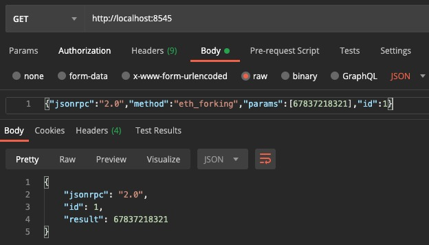
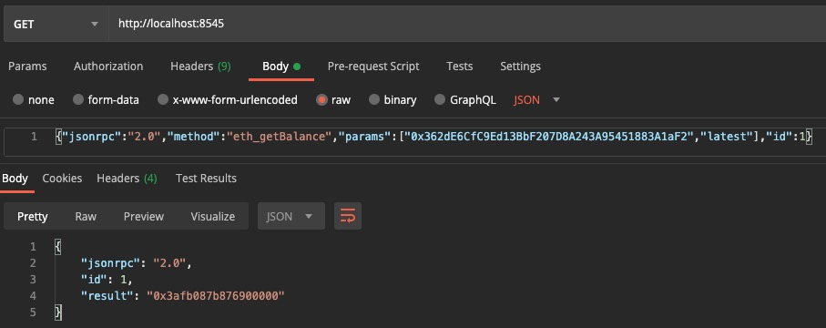
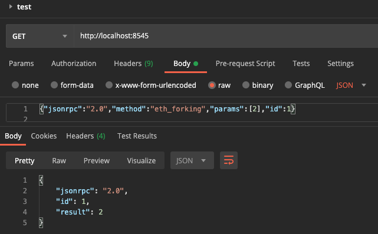
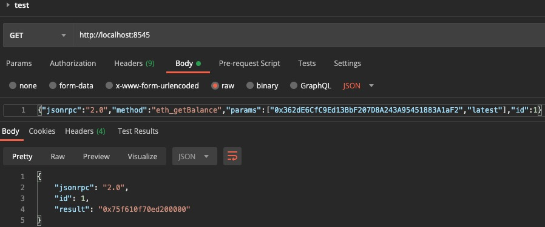
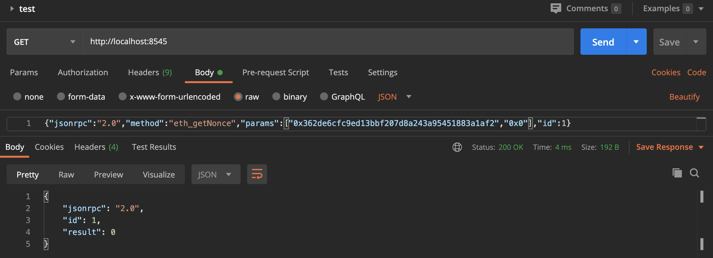

# 以太坊增加API实践过程

时间：2020.07.30

## 0x00

在./internal/ethapi/api.go中加入以下代码

```go
// 付铭自己加的
func (s *PublicBlockChainAPI) Forking(ctx context.Context, rate uint64) (uint64) {
	// attempt: store the rate info in context.
	// context.WithValue(ctx, "rate", rate)
	return rate
}
```

然后编译运行，在postman进行测试

> {"jsonrpc":"2.0","method":"eth_forking","params":[67837218321],"id":1}



可以看到结果正是我们想要的，但是，这样在console中不起作用。

## 0x01

再进行修改，把0x00的func (s *PublicBlockChainAPI) Forking(ctx context.Context, rate uint64) (uint64)进行修改，如下：

```go
// 付铭自己加的
var rateFlag uint64 = 1
// Start forking command.
// Rate is the fork coin's exchange rate.
func (s *PublicBlockChainAPI) Forking(ctx context.Context, rate uint64) (uint64) {
	// attempt: store the rate info in context.
	// context.WithValue(ctx, "rate", rate)
	rateFlag = rate
	return rate
}
```

声明了一个全局变量，然后再修改GetBalance函数，让每次得到的余额结果为原结果的rateFalg倍。

```go
// GetBalance returns the amount of wei for the given address in the state of the
// given block number. The rpc.LatestBlockNumber and rpc.PendingBlockNumber meta
// block numbers are also allowed.
func (s *PublicBlockChainAPI) GetBalance(ctx context.Context, address common.Address, blockNrOrHash rpc.BlockNumberOrHash) (*hexutil.Big, error) {
	state, _, err := s.b.StateAndHeaderByNumberOrHash(ctx, blockNrOrHash)
	if state == nil || err != nil {
		return nil, err
	}
	res:=big.NewInt(0) //声明res为大整数
  // 将state.GetBalance(address)与big.NewInt(int64(rateFlag))相乘存入res
	res.Mul(state.GetBalance(address),big.NewInt(int64(rateFlag)))
	// return (*hexutil.Big)(state.GetBalance(address)), state.Error()
	return (*hexutil.Big)(res), state.Error()
}
```

测试一下

> {"jsonrpc":"2.0","method":"eth_getBalance","params":["0x362dE6CfC9Ed13BbF207D8A243A95451883A1aF2","latest"],"id":1}



调用forking使rateFlag=2



再查询余额



可以看到返回的余额已经是原来的两倍。

## console

如何实现在console和postman都可以调用的API接口呢，下面是一个例子：

在./internal/ethapi/api.go中加入以下代码

```go
// 付铭自己加的
func (s *PublicBlockChainAPI) GetNonce(ctx context.Context, address common.Address, blockNr rpc.BlockNumber) (uint64, error) {
	state, _, err := s.b.StateAndHeaderByNumber(ctx, blockNr)
	if state == nil || err != nil {
		return 0, err
	}
	b := state.GetNonce(address)
	return b, state.Error()
}
```

然后在./internal/jsre/deps/web3.js中的`var getBalance = new Method({`下方加入以下代码

```go
var getNonce = new Method({
                name: 'getNonce',
                call: 'eth_getNonce',
                params: 2,
                inputFormatter: [formatters.inputAddressFormatter, formatters.inputDefaultBlockNumberFormatter],
                outputFormatter: formatters.outputBigNumberFormatter
            });
```

然后在下方return处加上`getNonce`。

注意这个时候编译运行之后console那里是不生效的，因为以太坊编译运行时用的不是web3.js这个文件，而是把web3.js和其他文件编译之后得到的bindata.go这个文件，所以在编译以太坊之前，需要对修改过的web3.js进行编译。

##### 编译web3.js

在web3.js的同级目录下有个名为deps.go的文件，里面有两个go命令，如下：

```go
package deps

//go:generate go-bindata -nometadata -pkg deps -o bindata.go bignumber.js web3.js
//go:generate gofmt -w -s bindata.go
```

运行此命令需要电脑上装有go-bindata，安装方法自行Google，安装完依次运行，成功之后就可以编译以太坊了。

##### 运行结果

在以太坊console输入`eth.getNonce(eth.accounts[0])`，可以看到已经得到结果。


在postman发送get请求也可以看到相同结果

