# 以太坊基础

## 1 以太坊概述

1. 出块时间从比特币的10min到以太坊的15s

   并开发出适应15s出块时间的共识机制ghost

2. 大量使用ASIC芯片，违背了去中心化的思想于是设计限制ASIC(asic resistance)

   proof of work 到 proof of stack

3. 加入对智能合约（同样去中心化）的支持

   技术手段取代司法手段中的合同运行

   优点：合同效率高，利用区块链不可篡改性保证不可违约

4. 以太坊中的货币ETH（最小单位wei）

## 2 以太坊账户

### 2.1 以太坊与比特币账户模型对比

（1）比特币中：计算utxo算账户余额，并且说明币的来源，而且要全部将钱花出，否则资金被记入tx fee

（2）以太坊中：基于账户的模型，仅需检验账户余额，不用说并币的来源

​	优点：天然防御比特币中的double spending attack（重复转账，花钱人不诚实）

​	缺点：交易时需要加入nonce计数器（被花钱人签名保护，全节点维护nonce值）防止replay  attack（重放攻击，收钱人不诚实）

### 2.2 以太坊中两种账户简介

（1）外部账户

包括：账户余额，nonce

（2）合约账户

包括：账户余额，nonce，code，storage（每个变量取值，外部账户调用时会改变）

合约账户不能直接被调用

以太坊中各个账户的地址是不可变的，为了保证智能合约的正常执行

## 3 以太坊中的数据结构

### 3.1 以太坊状态树

#### 3.1.1 trie树

Trie树，又称前缀树或字典树，是一种有序树，用于保存关联数组，其中的键通常是字符串。与二叉查找树不同，键不是直接保存在节点中，而是由节点在树中的位置决定。一个节点的所有子孙都有相同的前缀，也就是这个节点对应的字符串，而根节点对应空字符串。一般情况下，不是所有的节点都有对应的值，只有叶子节点和部分内部节点所对应的键才有相关的值。

但其也存在一些问题。当有一个很长的字符串的时候，这个字符串又和其他字符串没有重叠的话，那那么在trie中，存储和遍历都需要很多的节点，并且会导致trie树不平衡。

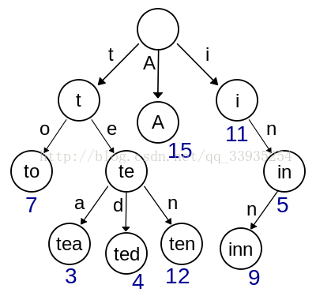

#### 3.1.2  Patricia树

​    Patricia树，或称Patricia trie，或crit bit tree，压缩前缀树，是一种更节省空间的Trie。对于基数树的每个节点，如果该节点是唯一的儿子的话，就和父节点合并。

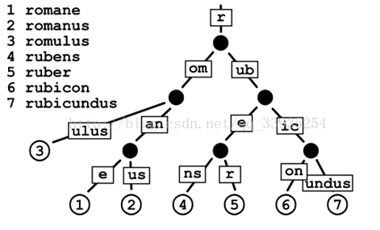

#### 3.1.3 MPT树

可以认为是包括不同种节点的带有哈希值指针的patricia tree

MPT树中的节点包括空节点、叶子节点、扩展节点和分支节点:

空节点，简单的表示空，在代码中是一个空串。

叶子节点（leaf），表示为[key,value]的一个键值对，其中key是key的一种特殊十六进制编码，value是value的RLP编码。

扩展节点（extension），也是[key，value]的一个键值对，但是这里的value是其他节点的hash值，这个hash可以被用来查询数据库中的节点。也就是说通过hash链接到其他节点。

分支节点（branch），因为MPT树中的key被编码成一种特殊的16进制的表示，再加上最后的value，所以分支节点是一个长度为17的list，前16个元素对应着key中的16个可能的十六进制字符，如果有一个[key,value]对在这个分支节点终止，最后一个元素代表一个值，即分支节点既可以搜索路径的终止也可以是路径的中间节点。

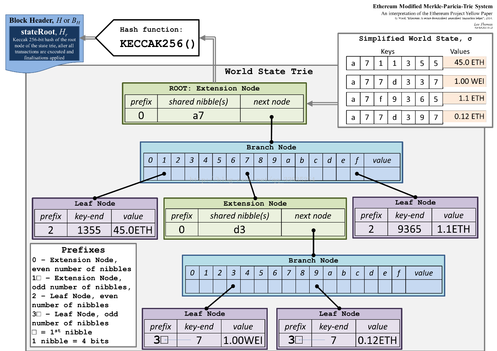

以太坊中是许多大mpt（代表不同账户）合约账户还包含小mpt（存储合约账户storage包含的各种信息），大多数节点通过指针共享（为什么不只写改变的账户？便于交易回滚，以太坊中的智能合约是图灵完备的，执行code以后想要再回滚是很困难的），发生改变的账户重写

下面是具体mpt树在geth代码中的定义的一些参数

(1) 区块块头

```go
type Header struct {
   ParentHash  common.Hash    `json:"parentHash"       gencodec:"required"`
   UncleHash   common.Hash    `json:"sha3Uncles"       gencodec:"required"`
   Coinbase    common.Address `json:"miner"            gencodec:"required"`
   // 矿工地址
   Root        common.Hash    `json:"stateRoot"        gencodec:"required"`
   // 状态树根哈希
   TxHash      common.Hash    `json:"transactionsRoot" gencodec:"required"`
   ReceiptHash common.Hash    `json:"receiptsRoot"     gencodec:"required"`
   Bloom       Bloom          `json:"logsBloom"        gencodec:"required"`
   // 交易收据日志组成的Bloom过滤器 
   Difficulty  *big.Int       `json:"difficulty"       gencodec:"required"`
   Number      *big.Int       `json:"number"           gencodec:"required"`
   GasLimit    uint64         `json:"gasLimit"         gencodec:"required"`
   GasUsed     uint64         `json:"gasUsed"          gencodec:"required"`
   Time        uint64         `json:"timestamp"        gencodec:"required"`
   Extra       []byte         `json:"extraData"        gencodec:"required"`
   MixDigest   common.Hash    `json:"mixHash"`
   Nonce       BlockNonce     `json:"nonce"`
}
```

（2）区块结构

```go
type Block struct {
   header       *Header
   uncles       []*Header
   transactions Transactions

   // caches
   hash atomic.Value
   size atomic.Value

   // Td is used by package core to store the total difficulty
   // of the chain up to and including the block.
   td *big.Int

   // These fields are used by package eth to track
   // inter-peer block relay.
   ReceivedAt   time.Time
   ReceivedFrom interface{}
}
```

（3）在网络上广播的区块信息

```go
type extblock struct {
   Header *Header
   Txs    []*Transaction
   Uncles []*Header
}
```

#### 3.1.4 状态树解决的问题

如果交易的收款方是从未听过的账户，全节点需要在状态树中新插入一个账户。

状态树中保留所有账户状态的目的之一是快速查找付款人的余额，如果像比特币一样，那么账户余额就得往前推算；目的之二是快速查询收款人是否是新建账户，因为转账过程中收款人的余额也得知道，否则无法更新，如果像比特币一样，一直往前找直到创世纪块才知道这个账户是新建的。

### 3.2 以太坊交易树与收据树

#### 3.2.1 概要

1. 交易树和收据树采用mpt树的原因

   - 为了方便，代码统一管理，因为账户状态树运用的也是mpt树

   - 加入了键值查找操作

   - 正常来说和普通比特币中的merkel树没有什么区别

2. 交易树和收据树的特点

   - 区块之间无共享节点
   - key值对应交易的number

3. bloom filter数据结构

   类似于把一个很长的列表内容，通过取hash映射到一个简单列表中

   便于查找，比遍历要方便，而且遍历近适用于全节点

   由于存在哈希碰撞，只可以证明交易一定不存在，但难证明交易一定存在

   bloom filter不支持删除操作

   最终想要获得全部信息，还是需要向全节点去获取

#### 3.2.2 交易树与收据树的介绍

每次发布的区块中，交易会组织成一棵交易树，也是一棵merkle tree，和比特币中情况类似；每个交易执行完之后会形成一个收据，记录交易的相关信息，交易树和收据树上的节点是一一对应的，增加收据树是考虑到以太坊的智能合约执行过程比较复杂，通过增加收据树的结构有利于快速查询执行结果。从数据结构上看，交易树和收据树都是MPT，和比特币有所区别，比特币的交易树就是普通的merkle tree ，MPT也是一种merkle tree，但是和比特币中用的不是完全一样。对于状态树来说，查找账户状态所用的key是地址，对于交易树和收据树来说，查找的键值就是交易在区块中的序号，交易的排列顺序由发布区块的节点决定。这三棵树有一个重要的区别，就是交易树和收据树都是只把当前发布的区块中的交易组织起来，而状态树是把系统中所有账户的状态都组织起来，不管账户和当前区块中的交易有没有关系。从数据结构上来说，多个区块的状态树是共享节点的，每次新发布的区块时，只有区块中的的交易改变了账户状态的那些节点需要新建分支，其它节点都沿用原来状态树上的节点。相比之下不同区块的交易树和收据树都是独立的。

#### 3.2.3 交易树和收据树的作用

交易树一个用途是merkle proof ，像比特币中用来证明某个交易被打包到某个区块里。收据树也是类似的，证明某个交易的执行结果，也可以在收据树里提供一个merkle proof。除此之外，以太坊还支持更复杂的查询操作，比如查询过去十天当中和某个智能合约有关的交易，这个查询方法之一是，把过去十天产生的所有区块中交易都扫描一遍，看看哪些是和这个智能合约相关的，这种方法复杂度比较高，且对轻节点不友好。

以太坊中的查询是引入了bloom filter（布隆过滤器），这个数据结构支持比较高效的查找某个元素是不是在一个比较大的集合里，bloom filter给一个大的集合计算出一个很紧凑的摘要，比如说一个128位的向量，向量初始都是0，通过hash函数，把集合中的每个元素映射到向量中的某个位置，元素的映射位置都置为1，所有元素处理完后向量就是一个摘要，这个摘要比原来的集合小很多。这个过滤器的作用是，我们想查询一个元素，但集合太大我们不能保存，这时候对该元素取hash值，发现映射到向量中0的位置，说明这个元素不在集合里，但是映射到向量中1的位置，也不能说明元素在集合里，因为可能会出现hash碰撞。所以用bloom filter时，可能会出现false positive，但是不会出现false negative，意思是有可能出现误报，但是不会出现漏报，在里面一定说在里面，不在里面可能也会说在里面。bloom filter有各种各样的变种，比如说像解决hash碰撞，有的bloom filter用的不是一个hash函数，而是一组，每个hash函数独立的把元素映射到向量中的某个位置，用一组hash函数的好处是，一般不可能一组hash函数都出现碰撞。

bloom filter的一个局限性不支持删除操作，因为存在hash碰撞，使得不同元素映射到向量同一个位置，如果删掉一个元素，使对应位置上的1变成0，那么和它发生碰撞的元素也被删除了，所以简单的bloom filter 不支持删除操作，可以将0和1改成计数器，记录有多少元素映射过来，而且还要考虑计数器是否会overflow，但是这样就复杂的多，和当初设计的理念就违背了，所以一般用bloom filter就不支持删除操作。

以太坊中bloom filter 的作用是，每个交易执行完成后会形成一个收据，收据里面就包含了一个bloom filter ，记录这个交易的类型、地址等其它信息，发布的区块在块头里也有一个总的bloom filter ，这个总的bloom filter 是区块里所有交易的bloom filter 的并集，所以说想查询过去十天当中和某个智能合约有关的交易，先查哪个区块的块头的bloom filter里有我要的交易的类型，如果块头的bloom filter里面没有，那么这个区块里面就没有我们想要的，如果块头的bloom filter 里有，我们再去查找区块里面包含的交易所对应的收据树里面对应的bloom filter，但是可能会出现误报，如果有的话，我们再找到相对应的交易进行确认，好处是通过bloom filter能快速过滤大量无关区块，很多区块看块头的bloom filter就知道没有我们想要的交易，剩下的少数候选区块再仔细查看。轻节点只有块头信息，根据块头就能过滤掉很多信息，剩下有可能是想要的区块，问全节点要具体信息。

以太坊的运行过程可以看作交易驱动的状态机（transaction-driven state machine），状态机的状态指状态树中的那些账户状态，交易指交易树中那些交易，通过执行这些交易，使得系统从当前状态转移到下一个状态。比特币也可以认为是交易驱动的状态机，比特币中的状态是UTXO。这两个状态机有一个共同特点是状态转移都是确定性的，对一组给定的交易能够确定性的驱动系统转移到下一个状态，因为所有的节点都要执行同样的交易，所以状态转移必须是确定性的。

#### 3.2.4 代码实现交易树，收据树

下图是交易树和收据树的创建过程，在NewBlock 函数中创建了交易树和收据树，并且得到了两者的根hash值

```go
func NewBlock(header *Header, txs []*Transaction, uncles []*Header, receipts []*Receipt) *Block {
   b := &Block{header: CopyHeader(header), td: new(big.Int)}

   // TODO: panic if len(txs) != len(receipts)
   if len(txs) == 0 {
      b.header.TxHash = EmptyRootHash//交易列表为空时，得到交易树的空哈希值
   } else {
      b.header.TxHash = DeriveSha(Transactions(txs))//下图具体实现DeriveSha函数实现返回哈希值
      b.transactions = make(Transactions, len(txs))//初始化交易列表
      copy(b.transactions, txs)//创建并写入交易列表
   }//创建交易树

   if len(receipts) == 0 {
      b.header.ReceiptHash = EmptyRootHash//收据列表为空时，得到收据树的空哈希值
   } else {
      b.header.ReceiptHash = DeriveSha(Receipts(receipts))//下图具体实现DeriveSha函数实现返回哈希值
      b.header.Bloom = CreateBloom(receipts)
      //后面具体实现调用CreateBloom函数创建区块的bloom filter
   }

   if len(uncles) == 0 {
      b.header.UncleHash = EmptyUncleHash//无叔父区块时，叔父区块总哈希值为空
   } else {
      b.header.UncleHash = CalcUncleHash(uncles)//得到叔父区块哈希值
      b.uncles = make([]*Header, len(uncles))//初始化交易列表
      for i := range uncles {
         b.uncles[i] = CopyHeader(uncles[i])
      }//通过循环构建叔父数组
   }

   return b
}
```

下图DeriveSha函数把transactions和receipts创建成trie

```go
func DeriveSha(list DerivableList) common.Hash {
   keybuf := new(bytes.Buffer)
   trie := new(trie.Trie)
   for i := 0; i < list.Len(); i++ {
      keybuf.Reset()
      rlp.Encode(keybuf, uint(i))
      trie.Update(keybuf.Bytes(), list.GetRlp(i))
   }
   return trie.Hash()
}
```

下图为trie的数据结构是一棵MPT树

```go
type Trie struct {
   db   *Database
   root node
}
```

下图是receipts（收据树）的数据结构

```go
type Receipt struct {
   // Consensus fields: These fields are defined by the Yellow Paper
   PostState         []byte `json:"root"`
   Status            uint64 `json:"status"`
   CumulativeGasUsed uint64 `json:"cumulativeGasUsed" gencodec:"required"`
   Bloom             Bloom  `json:"logsBloom"         gencodec:"required"`
   //该交易的bloom filter
   Logs              []*Log `json:"logs"              gencodec:"required"`
   //该交易的bloom filter由logs数组产生
   // Implementation fields: These fields are added by geth when processing a transaction.
   // They are stored in the chain database.
   TxHash          common.Hash    `json:"transactionHash" gencodec:"required"`
   ContractAddress common.Address `json:"contractAddress"`
   GasUsed         uint64         `json:"gasUsed" gencodec:"required"`

   // Inclusion information: These fields provide information about the inclusion of the
   // transaction corresponding to this receipt.
   BlockHash        common.Hash `json:"blockHash,omitempty"`
   BlockNumber      *big.Int    `json:"blockNumber,omitempty"`
   TransactionIndex uint        `json:"transactionIndex"`
}
```

下图是区块块头数据结构

```go
type Header struct {
   ParentHash  common.Hash    `json:"parentHash"       gencodec:"required"`
   UncleHash   common.Hash    `json:"sha3Uncles"       gencodec:"required"`
   Coinbase    common.Address `json:"miner"            gencodec:"required"`
   Root        common.Hash    `json:"stateRoot"        gencodec:"required"`
   TxHash      common.Hash    `json:"transactionsRoot" gencodec:"required"`
   ReceiptHash common.Hash    `json:"receiptsRoot"     gencodec:"required"`
   Bloom       Bloom          `json:"logsBloom"        gencodec:"required"`
   //区块中每个交易的bloom filter合并得到最终区块的bloom filter
   Difficulty  *big.Int       `json:"difficulty"       gencodec:"required"`
   Number      *big.Int       `json:"number"           gencodec:"required"`
   GasLimit    uint64         `json:"gasLimit"         gencodec:"required"`
   GasUsed     uint64         `json:"gasUsed"          gencodec:"required"`
   Time        uint64         `json:"timestamp"        gencodec:"required"`
   Extra       []byte         `json:"extraData"        gencodec:"required"`
   MixDigest   common.Hash    `json:"mixHash"`
   Nonce       BlockNonce     `json:"nonce"`
}
```

下图为CreateBloom具体实现

```go
//合并所有交易的bloom filter
func CreateBloom(receipts Receipts) Bloom {
   bin := new(big.Int)
   for _, receipt := range receipts {
      bin.Or(bin, LogsBloom(receipt.Logs))
      //用or函数分别合并所有交易的bloom filter
   }

   return BytesToBloom(bin.Bytes())
}
```

```go
生成单个交易的bloom filter
func LogsBloom(logs []*Log) *big.Int {
   bin := new(big.Int)
   for _, log := range logs {
      bin.Or(bin, bloom9(log.Address.Bytes()))
      //外层循环将logs数组中每个元素log的地址进行循环，调用bloom9函数取哈希，再用or函数分别合并
      for _, b := range log.Topics {
         bin.Or(bin, bloom9(b[:]))
      }
      //内层循环将logs数组中每个元素log的topics再进行循环，调用bloom9函数取哈希，再用or函数分别合并
      //内层循环和外层循环得到的结构都是合并到一起的，最终返回值bin
   }

   return bin
}
```

```go
//对每个log的地址和log中的所有topic取哈希操作
func bloom9(b []byte) *big.Int {
   b = crypto.Keccak256(b)//调用hash256函数对传入的参数取256位（32字节）哈希值

   r := new(big.Int)//将返回值初始化为0

   for i := 0; i < 6; i += 2 {
   //取生成哈希值的前6个字节，每两个字节组成一组，共3组
      t := big.NewInt(1)
      //对t赋值1
      b := (uint(b[i+1]) + (uint(b[i]) << 8)) & 2047
      //拼接两个字节，对2048取余数
      //因为以太坊中bloom filter是2048位
      r.Or(r, t.Lsh(t, b))
      //对t进行左移b位，再用or函数对循环中的3组进行合并
   }

   return r
}
```

查询相关bloom filter是否包含相关的topic

```go
func BloomLookup(bin Bloom, topic bytesBacked) bool {
   bloom := bin.Big()
   cmp := bloom9(topic.Bytes())//对要查询值取哈希
   return bloom.And(bloom, cmp).Cmp(cmp) == 0
   //先将要查询的值直接包含近bloom filter，再判断与原值比较是否相等
}
```

## 4 以太坊ghost共识协议

### 4.1 Ghost协议的引入

与比特币中区块链出块时间相比，以太坊区块链中将出块时间从10分钟提升到15秒，这是一个巨大的提升，然而同时带来了一个问题，那就是区块的共识问题。在15秒的时间内，一个新发布的区块很很大可能还没有扩散到整个区块链网络。在这种情况下，如何达到比特币中的共识协议，如何才能更好的遵守“链长为王”——最长的链会被认为主链呢？ 因为以太坊极大提升了出块时间，这引起的一个明显的问题就是频繁的区块链分叉问题，在15秒内很大可能有多个节点同时挖出一个区块，这些节点到底谁挖出的区块才能成为主链呢？ 如果继续沿用比特币中的区块奖励方法，假如几乎在同时有多个矿工挖出了一个区块，此时网络中占据较大算力的矿池其算力巨大，而且通常地理位置优越，其网络与更多的节点相连，它发布的区块能跟更快的在网络中传播，因此在出现区块链分叉时，其所在的分叉更有可能成为主链。这种情况下，其他算力较低的矿池或者个体节点就不能得到出块奖励，在以太坊中经常发生区块链分叉的情况，但最后区块链的出块奖励大部分情况下都被大型矿池拿走，而算力小的节点通常很少拿到奖励，这种情况叫做“Centralization Bias”。 如果以太坊沿用比特币中的出块奖励方式，算力较小的矿池几乎拿不到出块奖励，这个看起来不太公平，长此以往，算力小的矿工挖出区块之后就不愿意合并到算力强的矿工挖出的区块链中，因为合并就意味着前面的劳动全部白费了，还不如不要合并，继续在自己挖出的区块上继续挖矿，说不定运气好能超过算力强的区块呢。很明显，这样下去不利于区块链出现分叉后快速合并，会影响到区块链的共识，基于上述原因，以太坊的设计中引入了Ghost协议。

### 4.2 Ghost协议详情

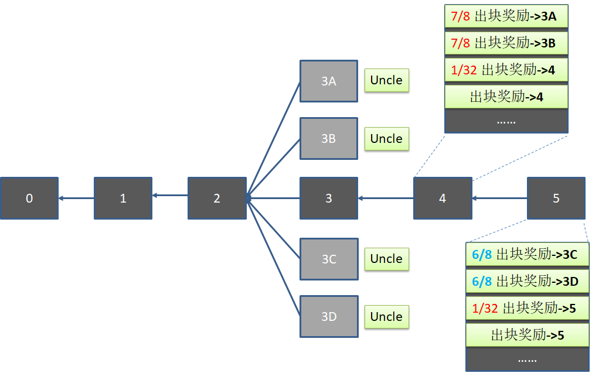

在以太坊中区块分叉是一个司空见惯的情况，因此区块链发生分叉之后尽快合并以维护区块链的统一显得尤为重要。在上图中，假设一个大型矿池A打包了一个黑色的3号区块，并将3号区块flooding发送出去，告知其他矿工3号区块已经被A挖掘出来了。以太坊中的出快时间是15秒，在15秒内这个3号区块并没有完全扩散到整个区块链网络中，因此其他没有收到这个区块的节点会继续挖掘3号区块。发布了3号区块之后A继续挖4号区块，在此过程中A陆续收到了其他节点挖出的3号区块的通知，上图中假设A收到了来自其他四个节点发布的3号区块（上图中灰色表示，分别是3A、3B、3C和3D），A收到这四个区块之后菊花一紧，意识到必须尽快挖出4号区块以证明自己所在的链才是主链，让他们在A发布的3号黑色区块上继续挖掘4号区块。有什么办法让其他节点认同并合并到A发布的3号区块呢？
A在正在挖掘的4号区块中添加上了2笔铸币交易（为什么是2笔，因为以太坊规定每个区块最多包含2个对叔父区块的奖励），着2笔铸币交易分别给了发布了3A和3B区块的矿工，两笔交易的价值分别是出块奖励的八分之七，A自己本身因为招安了两个分叉区块，除了出块奖励之外，可以额外得到出块奖励的三十二分之一，这些信息修改完毕之后，A继续开始玩命挖矿，因为A是一个较大的矿池，拥有很强的算力，所以A很快的挖到了4号区块。当A将4号区块发布出去后，一些节点还在挖掘4号区块或者3号区块的节点（尤其是3A和3B区块所在的矿工）收到这个区块后，立刻停下来检查A发布的4号区块的合法性，验证通过后都会停下手头的挖矿工作，认为A发布的4号区块最长合法链，于是继续在A发布的4号区块之后开始挖矿。
对于3A和3B来说，为什么会放弃原本的区块链而转到A所在的4号区块上继续挖矿呢？因为他们分别获得了出块奖励八分之七，和A继续竞争主链成功的概率不大，苦苦挣扎不如坦然接受招安，于是发布3A和3B的区块就继续在4号区块之后挖矿。而3B和3C也是几乎和3A、3B同时发布的区块，3A和3B区块得到了奖励，3C和3D难道就要被主链抛弃了吗？辛辛苦苦挖矿到头来毛都没有，这也不合适呀。以太坊设计的时候就想到了这种情况，一个区块上的分叉会出现很多个，因此在4号区块之后的5号区块，可以继续选择招安主链上的两个分叉区块，但最多招安2个分叉区块。于是5号节点的铸币交易中分别转给发布3C和3D区块的两个矿工出块奖励的八分之六，是的，没有看错，3C和3D的奖励和比3A和3B少了八分之一 ，，这是为什么呢？因为3C和3D是4号区块的uncle 区块，但是对于5号来说，和3C、3D的距离增加了2代，因此5号区块转给3C和3D的区块奖励就会少八分之二，。而5号区块也乐意参加招安工作，除了出块奖励之外，还可以得到额外三十二分之一，的出块奖励，不需要做很多工作就可以拿到一些奖励，岂有不招安之理？
整个区块中的Ghost协议是如何尽快招安分叉区块以组成统一的区块链，其过程用下图解释。

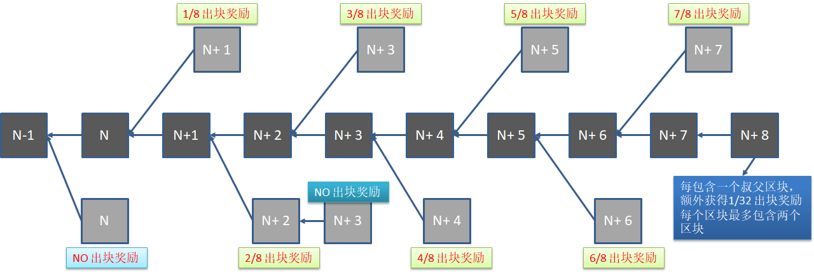

上图中，矿工挖掘第N+8个区块的时候，搜索主链上还没有被招安叔父区块，给这些挖出分叉叔父区块的矿工给予一定的奖励。叔父区块距离第N+8个区块越近，其矿工得到的奖励越多。最近的叔父区块（灰色的N+7号区块所在的矿工）可以拿到八分之七，的出块奖励，每隔一代，区块奖励就会减少八分之一，直到间隔8代以后的叔父区块不再获得奖励。在这个过程总，每个区块最多招安2个叔父区块。

而每个叔父区块被包含之后最多得到八分之七的出块奖励，最少为0。值得注意的是，这些叔父区块后面继续挖掘出来的区块不会得到任何奖励，这是为了激励其他区块在发现最长的区块链之后尽快进行合并。

### 4.3 总结

- 以太坊区块链中7代及其以内的叔父区块都能得到奖励，超过7代的叔父区块将不会得到奖励，这样是为了避免有些矿工专门在之前的链上制造分叉后坐等被后面的节点招安情况。
- 以太坊中的出块奖励不会随着区块数量的增多而减少，以太坊中无论何时出块都会获得出块奖励，而比特币中区块的树目超过两千一百万以后就没有出块奖励，此后矿工挖矿的动力来自于交易费了。

## 5 以太坊挖矿 

### 5.1 以太坊挖矿算法

#### 5.1.1 简介

比特币中的挖矿算法是一个天然赏金库。如果有挖矿捷径，便能获得大批比特币；缺点是算力过于聚集。

以太坊基于其缺点，希望做到ASIC resistance，算力分散更利于系统安全

比如增加系统内存访问能力的要求。因为在内存访问方面ASIC芯片与普通cpu相差不大，只不过算力很强。

scrypt哈希函数可以实现对内存访问能力增大，其实就是实现了一个很大的数组，从头到尾像链一样取哈希，前后相互依赖，如果不保存该数组的话，想要某个位置的数还要从头到尾求哈希，太麻烦，因此保存数组的过程就增加了内存访问。从而实现对ASIC芯片不友好。但是，因为所有节点都要保存这个数组，这里同样对轻节点验证过程也很复杂。

以太坊设计两个数组16M的cache和它生成的1G的dataset，cache类似于scrypt函数的数组。挖矿过程需要从小数组读取元素，从cache中读256个数最终首尾生成到两个一组的大dataset域值中，最终和target值去比较。

以太坊现在更多还是用GPU挖矿，不大量使用ASIC矿机的原因也是为了将来为转pos做准备。

#### 5.1.2 python简单实现挖矿

第一步，先生成16M的cache，cache中每个元素都是64字节的hash值，第一个元素是种子的hash，后面的每一个元素是前面一个元素的hash，这里的返回值o就是这个cache

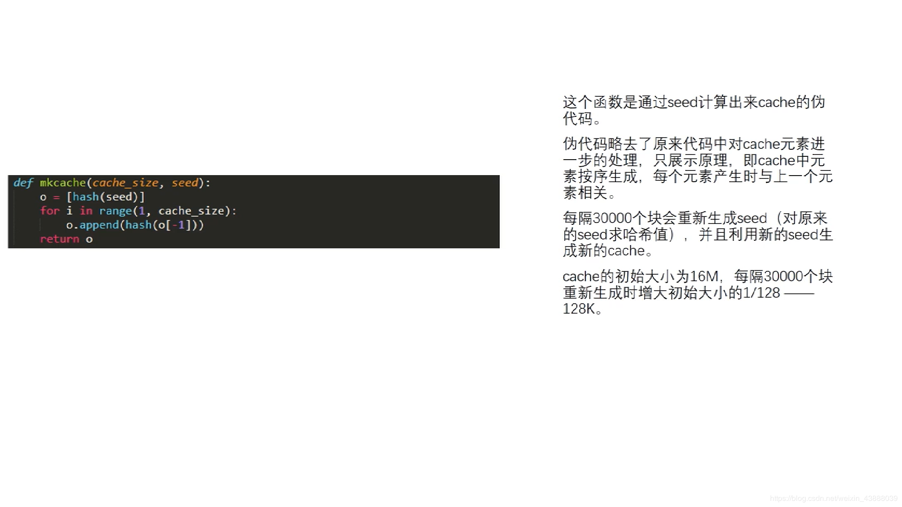第二步，从cache生成大数据集的单个元素，该函数实现生成dataset的第i个元素，从代码中可以看出来，最终的返回值不仅与该数在dataset中的位置有关系，也与在cache循环生成的256个伪随机数有关系

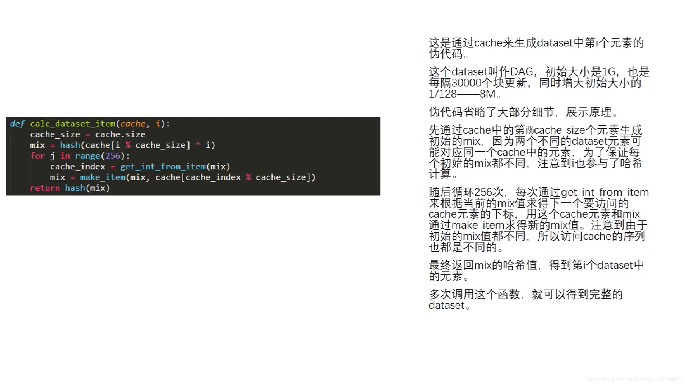

第三步，不断调用上一个函数生成dataset中的全部元素

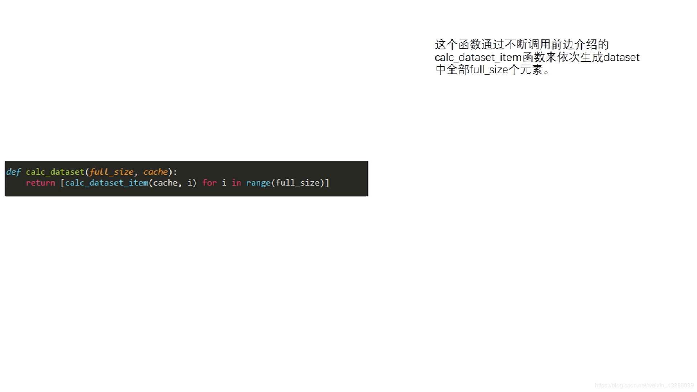

第四步，hashimoto_full是矿工挖矿使用的函数，最后的返回值就是算出来的哈希值，可以看到这个哈希值不仅与事先算出来的header和nonce生成的哈希值有关系 ，还和64轮在dataset中的循环取数有关系。

hashimoto_light是轻节点用来验证使用的函数，最后的返回值也是验证的哈希值，可以看到传来的参数发生了变化，是cache而不是dataset（因为轻节点的dataset是通过cache的算出来的，这里计算量并不是太大，因为毕竟轻节点也不用挨个hash值去试，算一次验证完就完事了）

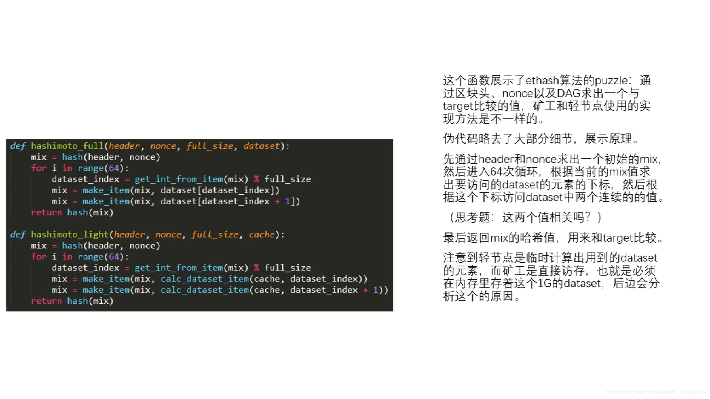

第五步，下面这个函数是矿工不断尝试nonce的过程，不断调用上面的hashimoto_full函数去验证，hash值是否小于等于target


### 5.2 以太坊挖矿难度调整

#### 5.2.1 难度调整简介

下图为以太坊难度调整公式

H为当前区块序号，D(H)为难度系数，

1. P(H)Hard为父区块的难度，每个区块的难度都是在父区块难度的基础上进行调整。
2. 每个区块都设置了最小难度下限，即不能低于Do=131072


如下图所示

1. x是父区块难度的1/2048的取整，是调整的**单位**。

2. ϵ2是**调整系数**,如上图的x*ϵ2就是难度调整的总值

3. y的取值依赖于父区块是否包含叔父区块，如果包含，则y=2，否则y=1。

4. 难度降低的上界设置为−99 ，主要是应对被黑客攻击或其他目前想不到的黑天鹅事件。(如果挖矿难度过低的话，会容易被黑客攻击)

5. Hs为本区块时间戳，P（H）hour stamp为父区块时间戳，二者相减即为本区块出块时间

   假设当父区块不带叔父区块的时候（y=1），调整过程举例如下：

   - 出块时间在[1,8]之间，出块时间过短，难度调大一个**单位**。
   - 出块时间在[9,17]之间，出块时间可以接受，难度保持**不变**。
   - 出块时间在[18,26]之间，出块时间过长，难度调小一个**单位**。


如下图所示为难度炸弹调整公式

设置难度炸弹的原因是要降低迁移到PoS协议时发生fork的风险，假若矿工联合起来抵制POS的工作量证明模式，那就会导致以太坊产生硬分叉；有了难度炸弹，挖矿难度越来越大，矿工就有意愿迁移到PoS协议上了。难度炸弹的威力，可以通过下图看出。

H′i称为fake block number，由真正的block number HiHi减少三百万得到。之所以减少三百万，是因为目前proof of stake的工作量证明方式还存在一些问题，pos协议涉及不够完善，但是难度炸弹已经导致挖矿时间变成了30秒左右，为了减小难度，就会减去三百万。

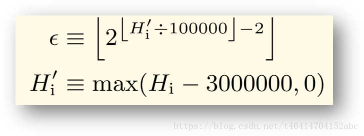

造成下图为难度炸弹值

因为突然调整了难度炸弹调整函数，因此还将出块奖励由5个eth变为3个eth，维持货币总供应量稳定

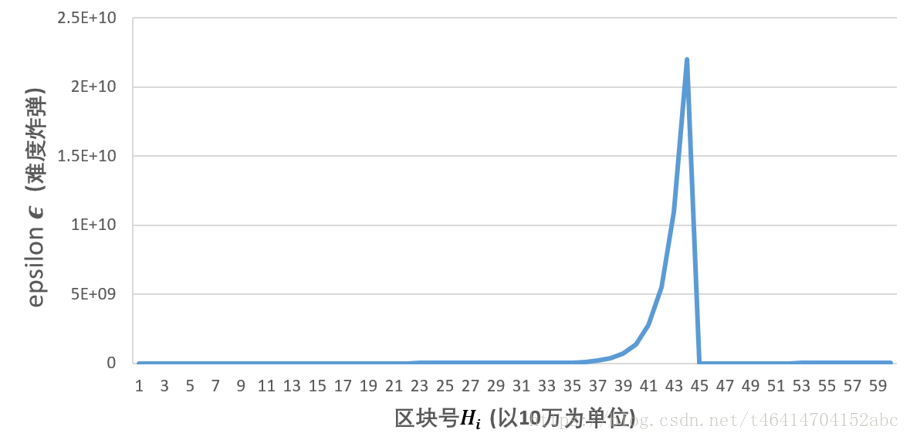

#### 5.2.2 geth代码实现

```go
// makeDifficultyCalculator creates a difficultyCalculator with the given bomb-delay.
// the difficulty is calculated with Byzantium rules, which differs from Homestead in
// how uncles affect the calculation
func makeDifficultyCalculator(bombDelay *big.Int) func(time uint64, parent *types.Header) *big.Int {
    // 输入父区块的时间戳和父区块的难度，完成计算当前区块的难度
	// Note, the calculations below looks at the parent number, which is 1 below
	// the block number. Thus we remove one from the delay given
	bombDelayFromParent := new(big.Int).Sub(bombDelay, big1)
	return func(time uint64, parent *types.Header) *big.Int {
		// https://github.com/ethereum/EIPs/issues/100.
		// algorithm:
		// diff = (parent_diff +
		//         (parent_diff / 2048 * max((2 if len(parent.uncles) else 1) - ((timestamp - parent.timestamp) // 9), -99))
		//        ) + 2^(periodCount - 2)
		//这是难度调整公式
		bigTime := new(big.Int).SetUint64(time)
        //先计算本区块时间戳
		bigParentTime := new(big.Int).SetUint64(parent.Time)
		//在计算父区块时间戳
		// holds intermediate values to make the algo easier to read & audit
		x := new(big.Int)
		y := new(big.Int)

		// (2 if len(parent_uncles) else 1) - (block_timestamp - parent_timestamp) // 9
		x.Sub(bigTime, bigParentTime)
		x.Div(x, big9)
		if parent.UncleHash == types.EmptyUncleHash {
			x.Sub(big1, x)
		} else {
			x.Sub(big2, x)
		}
		// max((2 if len(parent_uncles) else 1) - (block_timestamp - parent_timestamp) // 9, -99)
		if x.Cmp(bigMinus99) < 0 {
			x.Set(bigMinus99)
		}
		// parent_diff + (parent_diff / 2048 * max((2 if len(parent.uncles) else 1) - ((timestamp - parent.timestamp) // 9), -99))
		y.Div(parent.Difficulty, params.DifficultyBoundDivisor)
        //难度除以2048
		x.Mul(y, x)
		x.Add(parent.Difficulty, x)
		//x 此时等于当前区块难度值
		// minimum difficulty can ever be (before exponential factor)
		if x.Cmp(params.MinimumDifficulty) < 0 {
			x.Set(params.MinimumDifficulty)
            //MinimumDifficulty是难度的下限值131072
            //这里给当前区块难度值设置下限
		}
		// calculate a fake block number for the ice-age delay
		// Specification: https://eips.ethereum.org/EIPS/eip-1234
        //下面代码是难度炸弹计算
		fakeBlockNumber := new(big.Int)
		if parent.Number.Cmp(bombDelayFromParent) >= 0 {
            //bombDelayFromParent = 29999999
            //注意，这里因为是和父区块作比较所以不是减30000000
			fakeBlockNumber = fakeBlockNumber.Sub(parent.Number, bombDelayFromParent)
		}
		// for the exponential factor
		periodCount := fakeBlockNumber
		periodCount.Div(periodCount, expDiffPeriod)
		// the exponential factor, commonly referred to as "the bomb"
		// diff = diff + 2^(periodCount - 2)
		if periodCount.Cmp(big1) > 0 {
			y.Sub(periodCount, big2)
			y.Exp(big2, y, nil)
			x.Add(x, y)
		}
		return x
	}
}
```

## 6 以太坊智能合约

### 6.1 智能合约的创建

以太坊中的智能合约是运行在区块链上的一段代码，代码的逻辑定义了合约的内容。合约的账户保存了合约当前的运行状态，主要包含了4部分内容。

1. balance：当前余额
2. nonce： 交易次数
3. code： 合约代码
4. storge： 存储，是一棵MPT

智能合约一般使用Solidity语言进行编写，语法上与JavaScript相似。如下是一段Solidity编写的智能合约的代码,这段代码是一个商品拍卖的智能合约。所有参与拍卖的人员对商品进行竞价，每次竞价时都会将相应的价格发送到智能合约中，合约会自动记录竞价人的报价，拍卖结束时，出价最高者获得拍卖品，同时出价最高者的钱会发送给受益人。其他人可以使用withDraw函数拿回自己的钱。代码详细内容见注释。  

```solidity
pragma solididity ^0.4.21               // 声明使用的solidity版本
    contract SimpleAuction{                 // 声明一个SimplaAuction的合约类
        address public beneficiary;         // 拍卖受益人
        uint public auctionEnd;             // 拍卖截止日期
        address public highestBidder;       // 当前的最高出价人
        mapping(address => uint) bids;      // 所有竞拍者的出价，map结构，哈希映射
        address[] bidders;                  // 所有竞拍者数组，这里是一个任意长度的数组结构

        // 需要记录的事件,event主要用来记录日志
        event HighestBidIncreased(address bidder, uint amount); // 出价最高的人发生变动
        event Pay2Beneficiary(address winner, uint amount);     // 竞拍成功者的钱发送给受益人

        /// constructor是构造函数
        /// _biddingTime 表示拍卖时长
        /// _beneficiary 表示拍卖受益人
        constructor(uint _biddingTime, address _beneficiary) public
        {
            beneficiary = _beneficiary;
            auctionEnd = now + _biddingTime;
        }

        /// 对拍卖进行竞价，如果之前出过价，就会把之前的价格与当前价格求和作为竞价
        function bid() public payable{...}
        
        /// 参与投标的人在拍卖结束后取回自己的钱
        function withdraw() public returns(bool){}

        /// 结束拍卖，将最高出价的钱发送给受益人
        function pay2Beneficiary() public returns(bools){}
        }   
```

智能合约的构造函数名，最新版本使用constructor关键字，不推荐使用类名命名构造函数。构造函数只能有1个。构造函数仅仅在合约创建的时候调用一次。

- bid()函数中，可以看到有一个 payable 关键字。如果一个函数添加了关键字payable，表明该函数接受转账，如果一个函数不写payable关键字，表明该函数不接受转账。

- bid()函数， withdraw()函数，pay2Beneficiary()函数是成员函数，他们有public修饰，表示可供外部调用。

- solidity中的map，其结构不支持遍历，这就意味着需要手动记录map中的元素。一般使用数组进行记录。上述代码中使用bidders记录参与竞拍的人。solidity中的数组元素既可以是定长数组，也可以是可变数组。


编写好智能合约之后，如何将该智能合约发布到区块链上呢？在以太坊中，发布一个智能合约，只需要将该合约的内容写入到一笔交易即可。具体过程如下：

1. 利用一个外部帐户发起一个转账交易，这笔交易的收款地址为0x0，转账金额设置为0。
2. 将智能合约代码编译为二进制字节码，并将这些二进制字节码写入交易的data域。
3. 填写交易其他部分内容。
4. 发布交易，交易执行完毕后会返回智能合约的地址。

通过上述步骤就可以创建一个智能合约，以后调用智能合约时就将交易的收款地址写为智能合约的地址即可。

### 6.2 调用智能合约

智能合约无法主动执行，因此智能合约要么是被外部帐户调用，要么被其他智能合约调用，外部账户调用智能合约和内部账户调用智能合约的方法有所不同，下文将分别予以说明。

#### 6.2.1 外部账户调用智能合约

外部账户调用智能合约时，具体步骤如下：

创建一笔交易，交易的收款地址为要调用的智能合约的地址。
把要调用的函数名称和以及该函数需要的参数进行编码，随后填入data域中。
如果调用的函数有关键字payable修饰，即该合约接收转账，那么该函数中用到的转账金额则放在交易的value域中。
填写其他交易内容，发布交易。
矿工收到该交易后，本地执行该交易，将执行结果打包到区块中，发布区块。（注意这里矿工执行的顺序）
下图中的接收地址中填入了调用的智能合约地址，data域中填入了要调用的函数和参数的编码值，value为0。


#### 6.2.2 智能合约账户调用智能合约

智能合约之间的调用则不需要通过发布交易进行，而是直接使用代码进行交互，调用的方法一般分为2种：

- 第一种，创建被调用合约对象后直接调用相关成员函数
- 第二种，使用address类型的call()函数
- 实际上，还有另外一种智能合约调用方式，即使用delegatecall方法，而delegatecall则类似于我们的函数调用，delegatecall函数中使用的所有上下文参数，均来自于调用发起合约，而不是被调用的合约。

### 6.3 智能合约中的fallback()函数

allback()是一个很特殊的函数。它是智能合约中的一个匿名函数，这个函数没有名称、没有参数，也没有返回值，只有访问类型和函数体。其形式如下：

```
funcion() public [payable]{...}
```

匿名函数只有如下两种情况下才会被调用：

1. 向某个合约地址转账，data域为空时。
2. 向某个合约地址转账，data域中填写函数在智能合约中不存在时

用一句话总结，就是data域中的数据被解析后找不到一个可以匹配的函数，就会调用fallback()函数。

fallback()函数仍然可以用payable修饰，添加了payable函数之后表明匿名函数接收转账，如果没有payable，表明该函数不接收转账。如果匿名函数没有payable的情况下转账金额不是0，此时执行fallback()函数就会抛出异常。

### 6.4 区块块头中的gas限制

block header相关代码如下

```go
type Header struct {
   ParentHash  common.Hash    `json:"parentHash"       gencodec:"required"`
   UncleHash   common.Hash    `json:"sha3Uncles"       gencodec:"required"`
   Coinbase    common.Address `json:"miner"            gencodec:"required"`
   Root        common.Hash    `json:"stateRoot"        gencodec:"required"`
   TxHash      common.Hash    `json:"transactionsRoot" gencodec:"required"`
   ReceiptHash common.Hash    `json:"receiptsRoot"     gencodec:"required"`
   Bloom       Bloom          `json:"logsBloom"        gencodec:"required"`
   Difficulty  *big.Int       `json:"difficulty"       gencodec:"required"`
   Number      *big.Int       `json:"number"           gencodec:"required"`
   GasLimit    uint64         `json:"gasLimit"         gencodec:"required"`
   //区块限定的总汽油费总量，这里不是所有的交易限定汽油费总量相加，因为交易的限定的汽油费是交易人设定的
   GasUsed     uint64         `json:"gasUsed"          gencodec:"required"`
   //挖出矿的矿工消耗的总汽油费
   Time        uint64         `json:"timestamp"        gencodec:"required"`
   Extra       []byte         `json:"extraData"        gencodec:"required"`
   MixDigest   common.Hash    `json:"mixHash"`
   Nonce       BlockNonce     `json:"nonce"`
}
```

### 6.5 汽油费(gas fee)

智能合约的设计语言solidity是图灵完备语言，这就意味着智能合约中可以包括循环。随之而来的问题是，如果智能合约中出现死循环怎么办？而程序在执行之前无法判断是否会出现死循环。因此，智能合约中引入了汽油费。智能合约执行在EVM中，EVM对执行指令进行了标价，每执行一条指令，就需要消耗相应的汽油，不同的指令因为复杂程度不同，消耗的汽油量会有所不同。

回想一下以太坊中一笔交易的结构：

```
type txdata struct{
    AccountNonce    uint;                   // 交易次数
    GasPrice        *bit.Int;               // 单位汽油价格
    GasLimit        uint64;                 // 本交易愿意支付的最大汽油量
    Recipient       *common.Address         // 接收账户地址
    Amount          *big.Int                // 转账金额
    Payload         []byte                  // data域
}
```

每个交易中都有一个gas limit字段，表明发起交易方最多支出的汽油量，另外，交易中的gas price字段表明交易发起方对每单位的汽油出的价格，gas price*gas limit就是这笔交易消耗的最大汽油费。
如果执行中出现了死循环，执行所需要的gas fee就会超额，此时EVM就会强行停止智能合约的执行，并且回滚之前的所有操作，但之前执行消耗的汽油费不会退回给交易发起方，这样就能有效的防止死循环，同时避免以太坊中的节点收到Denial of Service攻击。

### 6.6 智能合约中的条件判断

以太坊中的交易进行执行，可以看作是一个原子操作，要么全部执行完毕，完成转账；如果执行抛出异常，则执行中的操作全部回滚。所以智能合约在执行时有如下条件判断的语句，在执行前会判断条件，说明如下：

- 智能合约中不存在自定义的try-catch的结构。
- 智能合约执行过程中遇到异常，除非特殊情况，否则本次的执行操作会全部回滚。
- solidity中可以抛出错误的语句有：
  - assert(bool condition):如果条件不满足就会抛出错误，用于抛出内部错误，和c++中的assert相同，可以用于Debug。
  - require(bool condition):如果条件不满足，也抛出错误，用于检测外部输入条件是否合法。
  - revert():无条件抛出异常，终止运行并且回滚状态变动。

智能合约执行中可以调用以下函数获取信息

```
// 获取给定区块的哈希值，只能获取最近的256个区块，不包括当前区块。   
block.blockhash(uint blockNumber) returns (bytes32)                                                  
block.coinbase(address)                 // 挖出当前区块的矿工地址                 
block.difficulty(uint)                  // 当前区块的难度
block.gaslimit(uint)                    // 当前区块的gas限额
block.number(uint)                      // 当前区块号
block.timestamp(uint)                   // 当前区块以秒计数的时间戳

// 如下是智能合约可以获得的调用信息
msg.data        (bytes)                 // 完整的调用信息(calldata)
mas.gas         ( uint)                 // 剩余的gas
mas.sender      (address)               // 消息发送者(当前调用)
msg.sig         (bytes4)                // calldata的前4字节（即函数标识符）
msg.value       (uint)                  // 随消息发送的wei的数量
now             (uint)                  // 目前区块的时间戳(和前面的block.timestamp相同)
tx.gasprice     (uint)                  // 交易的gas价格
tx.origin       (address)               // 交易发起者
```

需要说明的有如下两点：

智能合约调用的信息，全部是变量，而不是函数调用，括号中的类型，是这些变量的返回类型。
msg.sender和tx.origin是有区别的，msg.sender表示调用当前合约的地址，不一定是交易的发起者。因为一笔交易中发起的合约A可以调用合约B，此时对于B来说，msg.sender是A，tx.origin是交易发起者。

### 6.7 evm执行智能合约的一些问题

- 矿工执行某个调用智能合约的交易，执行过程中出错，是否需要发布到区块链上？

  答：需要发布到区块链上，虽然执行失败，但是需要扣掉gas fee，发布到区块链上，其他矿工执行失败时也相应的扣掉汽油费，只不过此时扣掉的汽油费不是转给自己，而是转给发布区块的矿工账户。

- 先执行智能合约再发布区块，还是先发布区块再执行智能合约？

  答：先执行智能合约，再发布到区块。每一个新发布区块中最新的三个状态树、交易树、收据树的哈希值，都是执行完智能合约之后才能得到。挖到区块的矿工发布区块之后，其他矿工随之执行新区块中的交易，同步更新本地存储的状态树、交易树和收据树，以此维持数据同步。

- 智能合约支持多线程吗？

  智能合约的solidity不支持多线程。以太坊是一个交易驱动的状态机，因此面对同一种输入，必须到达一个确定的状态。但是多线程的问题在于多核对内存访问顺序不一样，就会引起状态变化，这不利于维护区块链中状态的一致性。同时，其他可能造成不一致的操作，智能合约也不支持。最明显的例子就是以太坊中的智能合约没办法产生真正意义下的随机数。

- 智能合约中的重入攻击

  在智能合约执行操作时要注意顺序

  如果是以下顺序则容易造成重入攻击 

  1. 把相关账户的余额保存在一个变量
  2. 把账户余额转给相关账户
  3. 如果转账成功，把相关的账户余额清零

  正确的顺序应该是

  1. 把相关账户的余额保存在一个变量
  2. 把相关的账户余额清零
  3. 把账户余额转给相关账户

  除了修改转账顺序，还可以采取transfer或者send的转账方式，因为相关消耗汽油费仅2300


## 7 以太坊evm虚拟机

### 7.1 简介

可以当成是solidity编写的智能合约的运行环境，就像java程序也有自己的虚拟机JVM，evm虚拟机把solidity语言编写成二进制码，让计算机可识别

注意：所有网络节点运行evm

作用：交易验证，运行智能合约

evm是被沙盒完全封装的，是被完全隔离的

通过evm虚拟机牺牲一部分效率，为了保证去中心化，并达成共识

### 7.2 evm和账户

外部账户和内部账户在evm中公用同一个地址空间，因此evm对两类账户的操作是一样的

### 7.3 evm和交易

外部账户调用外部账户和外部账户调用合约账户的时候都需要evm去解析

### 7.4 evm和gas

gas用来量化evm消耗成本

运行一个交易的时候gas是逐渐消耗的

gas耗尽触发out-of-gas异常，最终状态回滚；如果最终执行完未耗尽则将剩余gas退还

### 7.5 evm数据存储

storage：（类似于硬盘）每个账户都有这一部分存储空间，key-value形式存储，保存你账户合约的所有状态变量（余额之类的），这里面状态变量是无法遍历的

memory：（内存）执行交易时，处理代码中临时变量，读写gas开销小

stack：（类似于寄存器）后进先出，比内存更小，在执行中函数间互相引用的时候，stack记录这种过程，可以说记录了合约执行的始终

## 8 以太坊基础总结

1. 智能合约并不智能，虽然可以任意解决人们生活中的许多问题，但是一旦发布拥有不可篡改性

2. 账户私钥，或者智能合约出现安全漏洞，应该立即将资金转移至安全账户。智能合约出现漏洞，应该用黑客手段将资金转移

3. 区块链的不可篡改性有一定权限。the dao事件就是利用了对区块链的篡改，所以区块链同样也可以受到中心的调控，一旦遇到重大事件，还是可以篡改的

4. 智能合约如果想要把账户中的钱转走，需要外部调用，这属于solidity的特性，与我们正常思维不一样，所以这里很可能出现安全漏洞，是否应该采取函数型语言编写，有待研究，智能合约本身也有许多模板，是可以不用完全自己开发的，跳过了许多安全漏洞

5. 合约开源的优点？

   提高公信力，大家都可以对合约进行检查因而不容易出现漏洞（但真正有时间研究源代码的人是少之又少，所以合约涉及财产时一定要谨慎）

6. 硬分叉真的只是以太坊开发团队决定的？

   最后硬分叉成功，是因为大部分矿工自愿加入升级软件，区块链的世界使用挖矿来进行投票的

   分叉正是去中心化的体现，在用户不满意时，用户有权采用分叉方式，这在中心化系统中是不可能实现的

7. 去中心化不等于分布式

   去中心化一定是分布式，但是分布式系统不一定去中心化

   比特币，以太坊都是交易驱动的状态机，去中心化系统大多数计算机要执行相同操作，为的是提高容错，效率很低

   但是分布式系统不同计算机执行不同的操作，提高算力，大多数分布式系统不是去中心化模式的，因为要提高效率

   只有需要建立共识的操作需要使用智能合约


